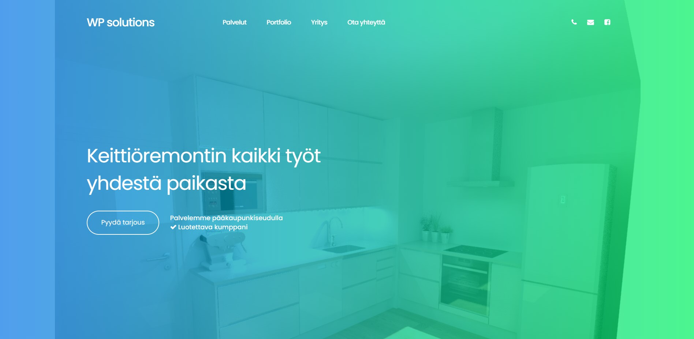

# Classic WordPress Theme for a Renovation Company

This repository contains a classic WordPress theme specifically designed for a renovation company. This theme was developed as a client project that needed a professional online presence. The goal was to create a website that is visually appealing, easy to navigate, and optimized for presenting renovation services and project portfolios.The theme provides a clean design that highlights services, showcases completed projects, and makes it easy for potential clients to get in touch.

The final version of the site is published at: <a href="https://prolive.fi" target="_blank">https://prolive.fi</a>

## Features

<b>Visually Engaging Homepage</b> 
The homepage creates a strong first impression with a clean layout, colors and work images.

<b>Services Presentations</b> 
A dedicated section for presenting services in a clear and structured way.

<b>Portfolio with Images and Descriptions</b> 
A portfolio section allows showcasing completed renovation projects. Each project includes images and a short description, providing visitors with insights into quality, style, and expertise.

<b>Company Overview</b> 
A company introduction section gives background information, mission, and values.

<b>Contact Form</b> 
An integrated contact form enables visitors to easily reach out for inquiries or consultation requests.

<b>Google Map</b> 
An embedded Google map makes it simple for clients to find the business location.

<b>Responsive Design</b> 
The theme is fully responsive and optimized for desktop, tablet, and mobile devices, ensuring a seamless user experience across all screen sizes.

## Technology Used
- **WordPress (Classic Theme Development)** – Theme structure, templates, hooks, filters  
- **PHP** – Custom theme functions, registering navigation menus, enabling thumbnails, custom post type for portfolio  
- **Custom WordPress Features**  
  - Custom Post Type (`portfolio`) and taxonomy for project categorization  
  - Custom admin column to display featured images in the dashboard  
  - Navigation menu customization (`wp_nav_menu_args`)  
- **JavaScript / jQuery** – UI interactivity, animations, smooth scrolling  
- **Custom JavaScript (custom.js)**  
  - Preloader animation  
  - Responsive menu collapse  
  - Sticky navigation on scroll  
  - Parallax effect (`jquery.stellar.js`)  
  - Image lightbox and gallery (`Magnific Popup`)  
  - Portfolio filtering (`Filterizr`)  
- **AJAX Contact Form**  
  - **Frontend (`app.js`)** – jQuery-based AJAX form submission with validation and user feedback  
  - **Backend (`mailer.php`)** – PHP mailer script with input sanitization and localized success/error messages  
- **HTML5 & CSS3** – Page layout and styling  
- **Bootstrap** – Responsive grid system and UI components  
- **Font Awesome** – Iconography  
- **Google Maps Embed API** – Location integration

Below is a gif that illustrates the frontend view of the WordPress theme.

